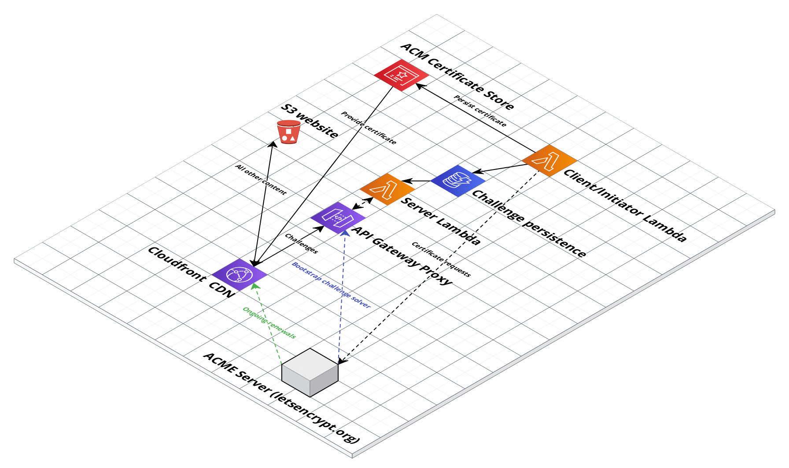

# ACME SLS

[](https://pkg.go.dev/github.com/sjauld/acme-sls/)
[](https://sonarcloud.io/summary/new_code?id=sjauld_acme-sls)

Implementations of the [ACMEv2](https://letsencrypt.org/how-it-works/)
[HTTP-01](https://datatracker.ietf.org/doc/html/rfc8738) and
[TLS-ALPN-01](https://datatracker.ietf.org/doc/html/rfc8737) challenges
that decouple the certificate request from the end server. Designed for use in
AWS serverless (or similar) environments.

## Implementations

Two working implementations are available in this repo:

* [HTTP-01 (AWS Lambda / S3)](HTTP-01 (AWS Lambda / S3))
* [HTTP-01 (Local demonstration)](HTTP-01 (Local demonstration))

Two incomplete/doomed implmentations are also provided:

* [HTTP-01 (AWS Lambda / API Gateway)](HTTP-01 (AWS Lambda / API Gateway))
* [TLS-ALPN-01 (AWS Lambda / ACM)](TLS-ALPN-01 (AWS Lambda / ACM))

### HTTP-01 (AWS Lambda / S3)

A complete working implementation of HTTP-01 that stores the challenge keyauth
in an S3 bucket. This can then be served to the CA via the S3 bucket website
functionality.


#### Quickstart

Prerequisites:

* [Terraform](https://www.terraform.io/)
* [AWS Account](https://aws.amazon.com/)
* [AWS credentials](https://registry.terraform.io/providers/hashicorp/aws/latest/docs#authentication)
  (hint: [aws-vault](https://github.com/99designs/aws-vault) rules)
* A domain name and access to create DNS records

Create a `main.tf` file containing the following:
```
provider "aws" {
  region = "us-east-1"
  # If you want you can include your access_key and secret_key here, but it's
  # far safer to just configure this in your ~/.aws/credentials file
  # access_key = ""
  # secret_key = ""
}

module "acme_sls" {
  source = "git@github.com:sjauld/acme-sls.git//terraform?ref=v0.1.0"

  certificates = {
    "example.com" = ["example.com", "www.example.com"],
  }
}

output "cname_records" {
  value = module.acme_sls.cname_records
}
```
Build the resources with `terraform apply`. You will then need to create CNAME
records that point your domain name(s) to the associated S3 buckets. If you
are using Route53 as a DNS provider, see
[the example](./terraform/example/main.tf) for how to do this. If you are not
using Route53, it is still recommended to use Terraform to create the records,
but if you need to do it manually, it is recommended to use the
`first_run_delay` variable to give yourself more time to manually create the
records. For more information/options, see the
[terraform README](./terraform/README.md).

After 5 minutes (or `first_run_delay` if you specify it) you should see your
certificate(s) created in ACM in us-east-1.

#### Building

If you're not the sort of person who trusts random binaries distributed via
public zip files, you can build the lambda function yourself. Prerequisites:

* [Go](https://go.dev/)

Simply check out this repo and run
`GOOS=linux GOARCH=amd64 go build -o lambda-http-s3 ./client/lambda-http-s3`.
You can then zip that binary and use the `lambda_zipfile` argument to feed it
in to the terraform module.

#### Next steps

In order to actually use the certificate you'll need to attach it to a
Cloudfront distribution, or Elastic Load Balancer. Remember to route port 80
from `.well-known/acme-challenge/*` to the S3 bucket so that the automatic
renewal process will work. The lambda fires every day, checks the certificate's
validity period and then renews it if there are less than 7 days remaining.

### HTTP-01 (Local demonstration)

This HTTP-01 solver is for demonstration purposes - you can use it locally to
see how the certificate creation flow works.

Prerequisites:

* [Docker](https://www.docker.com/)
* [Go](https://go.dev/)

You can spin up everything you need docker; simply run
`docker-compose up` and you'll be up and running with a test CA, local
DynamoDB container and a local server to solve challenges. You can then generate
a certificate with the sample local client implementation. Open a second
terminal and enter the following:

```
cd client/local-http
go run .
```

This will generate a certificate signed by
[Pebble](https://github.com/letsencrypt/pebble).
Client side logs will be printed in the second terminal, while the CA and our
challenge server logs will be printed in the docker compose console.

If for some reason you want to sue this to create self-signed certificates for
different domains, just update the domains variable in
`client/local-http/main.go` and add your domains as aliases to the gin container
in `docker-compose.yml`

### HTTP-01 (AWS Lambda / API Gateway)

Unfortunately the initial design (routing challenges via AWS API Gateway) was
flawed since API Gateway doesn't listen on port 80. The keyauth could be moved
to somewhere else like ECS but this would start to become less serverless.




### TLS-ALPN-01 (AWS Lambda / ACM)

The TLS-ALPN-01 solver takes advantage of the fact that API Gateway lets you
claim custom domains with a self-signed certificate (Cloudfront doesn't allow
this). This allows us to prove ownership of a domain without having any code at
all, since the verification is done during the TLS handshake. Initial testing
of this implementation stalled as Let's Encrypt did not like something about the
format of the challenge certificate served by ACM - more testing using our own
CA server could provide more insight.


