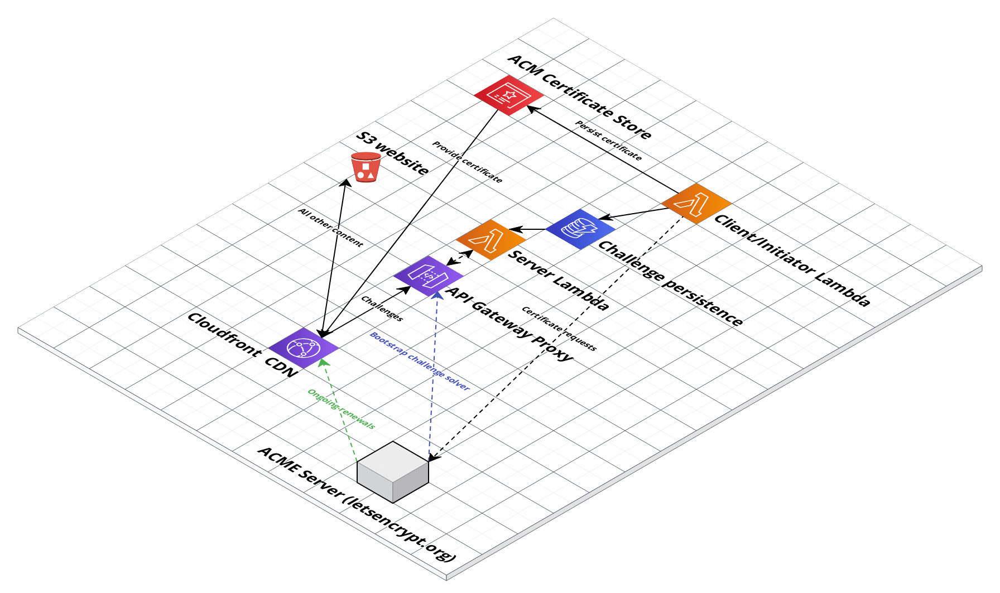

# ACME SLS

[](https://pkg.go.dev/github.com/sjauld/acme-sls/)
[](https://sonarcloud.io/summary/new_code?id=sjauld_acme-sls)

An implementation of the ACMEv2 HTTP-01 challenge solver that decouples the
certificate request from the end server. Designed for use in AWS serverless
(or similar) environments.

## Cloud architecture



## Certificate creation workflow


## Testing locally

You can spin up everything you need locally using docker; simply run
`docker-compose up` and you'll be up and running with a test CA, local
DynamoDB container and a local server to solve challenges. You can then generate
a certificate with the sample local client implementation:

```
cd client/local
go run .
```

This will generate a certificate signed by
[Pebble](https://github.com/letsencrypt/pebble).
