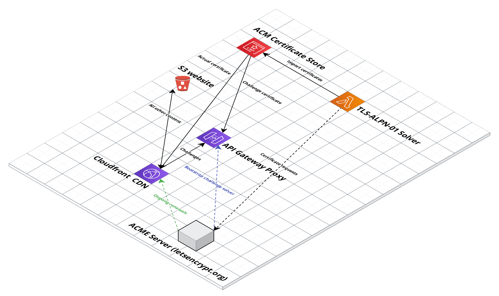

# ACME SLS

[](https://pkg.go.dev/github.com/sjauld/acme-sls/)
[](https://sonarcloud.io/summary/new_code?id=sjauld_acme-sls)

Implementations of the ACMEv2 TLS-ALPN-01 and HTTP-01 challenges that decouples
the certificate request from the end server. Designed for use in AWS serverless
(or similar) environments.

The HTTP-01 solver is for demonstration purposes - you can use it locally to
see how the certificate creation flow works. Unfortunately the initial design
(routing challenges via AWS API Gateway) was flawed since API Gateway doesn't
listen on port 80. The server could be moved to somewhere else like ECS but
this would start to become less serverless.

The TLS-ALPN-01 solver takes advantage of the fact that API Gateway lets you
claim custom domains with a self-signed certificate (Cloudfront doesn't allow
this). This allows us to prove ownership of a domain without having any code at
all, since the verification is done during the TLS handshake.

## Cloud architecture



## Certificate creation workflow


## Usage

We provide a terraform module to enable you to easily spin up your own instance
of the ACME SLS platform.

### Prerequisites

* AWS account
* Domain name
* Terraform


@TODO bootstrapping, usage etc

### Manually triggering the lambda function

From the Lambda console, navigate to the test tab and then modify the following
event to test your function:

```
{
  "detail": {
    "id": "test",
    "domains": ["acme-sls.viostream.xyz", "subdomain.acme-sls.viostream.xyz"]
  }
}
```

## Testing locally

You can spin up everything you need locally using docker; simply run
`docker-compose up` and you'll be up and running with a test CA, local
DynamoDB container and a local server to solve challenges. You can then generate
a certificate with the sample local client implementation:

```
cd client/local
go run .
```

This will generate a certificate signed by
[Pebble](https://github.com/letsencrypt/pebble).
